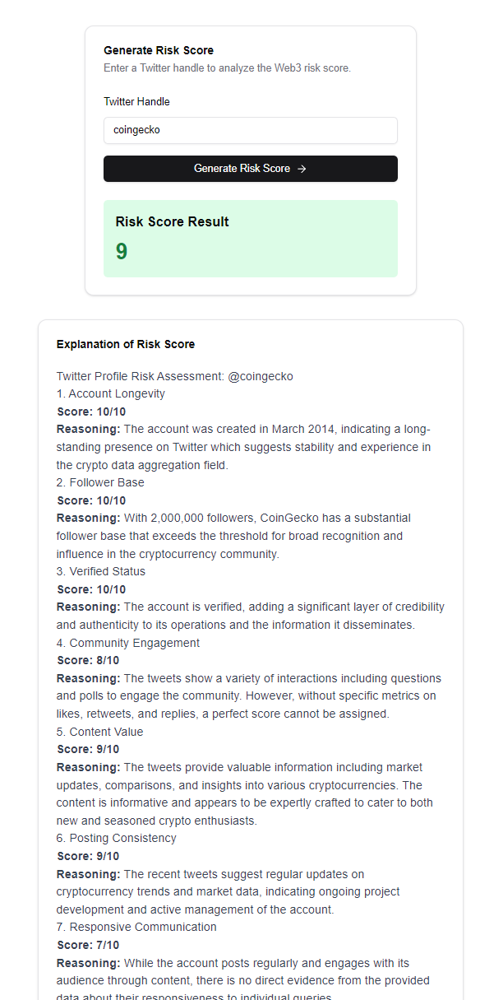

# Web3 Risk Score Generator

This project is an AI-powered tool that generates risk scores for Web3 projects based on their Twitter presence. It uses a 10-point scoring system to provide a comprehensive assessment, helping users make informed decisions in the crypto space.



## Features

- Quick assessment using just a Twitter handle
- 10-point scoring system for comprehensive evaluation
- Data-driven insights for objective risk assessment
- User-friendly interface for easy navigation and use

## Getting Started

### Prerequisites

- Node.js (v14 or later)
- npm (v6 or later)

### Installation

1. Clone the repository:
   ```
   git clone https://github.com/Group-2-Encode-AI-GPT-Bootcamp/final-project.git
   ```

2. Navigate to the project directory:
   ```
   cd final-project
   ```

3. Install the dependencies:
   ```
   npm install
   ```

4. Set up environment variables:
- Create a file named `.env.local` in the root of your project
- Add your OpenAI API key to the file:
  ```
  OPENAI_API_KEY=your_api_key_here
  ```


Replace `your_api_key_here` with your actual OpenAI API key.

### Running the Application

1. Start the development server:
   ```
   npm run dev
   ```

2. Open your browser and visit `http://localhost:3000`

## Project Structure

- `app/`: Contains the main application code (Next.js App Router)
- `components/`: Reusable React components

## Technologies Used

- Next.js
- React
- Tailwind CSS
- Shadcn UI
- OpenAI SDKs
- Puppeteer for web scraping

## Contributing

Contributions are welcome! Please feel free to submit a Pull Request.

## License

This project is licensed under the MIT License.